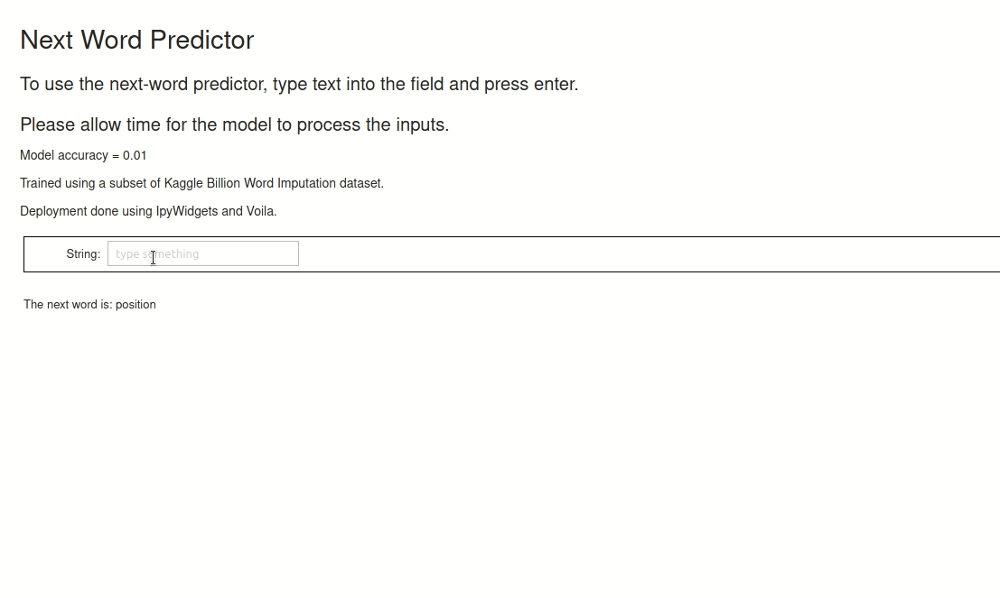

# Pencil Project
Next word prediction project for Pencil Learning

## Video Demonstration

## Model Information
Model is built on Tensorflow 2.4.1.  
Workflow is as follows: 
* Passing a user-typed sentence to USE to get a 512 dimensional vector sentence embedding.  
* Pass vector through a series of dense layers. 
* Go to output dense layer of 100000 neurons, corresponding to Vocab size
* Use Softmax on output layer to normalize and get best prediction for the corresponding word.

## Data Information

Model was trained using a subset of the billion-word imputation dataset from Kaggle.
Data was preprocessed to remove sentences containing *strange* characters such as "-, --, (, =, ...".  

From resulting dataset, a random sized kernel was passed over each sentence to get a sub-sentence, and its next word. Next word 
was processed to remove the most common english words in an attempt to avoid dataset imbalances.  
Resulting dataset had 233000 unique words, of which the most 100000 most common were chosen as the vocabulary.

## Model Training and Performance

Model was trained using a GTX 1070ti for 3 epochs, resulting in an accuracy of 0.01.  
It was not trained for further iterations due to loss not decreasing significantly.  
A greater amount of data was not used due to time and memory limitations.

## Hosting
Hosting was done locally using Voila with IpyWidgets. Due to issues with git lfs and using standard apps such as
MyBinder and Heroku, the public domain hosting was unfortunately unable to be completed. 
